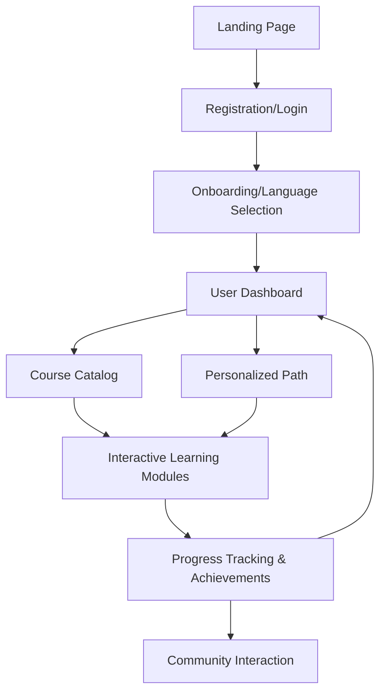

## 1. Product Overview
An immersive, multilingual online education platform supporting English, Japanese, Korean, and other mainstream languages.
- Brief description of main purposes, problems to solve, target users: To deliver an engaging language learning experience with leveled courses, interactive modules, and personalized paths. Targets language learners of all levels seeking comprehensive skill development.
- Target or market value of the product: Provides a one-stop solution combining structured learning, interactive practice (vocabulary, grammar, shadowing, listening), progress tracking, and community engagement.

## 2. Core Features

### 2.1 User Roles
| Role | Registration Method | Core Permissions |
|------|---------------------|------------------|
| Learner | Email/Social login | Access courses, track progress, participate in community |
| Admin | Pre-provisioned | Manage courses, modules, and monitor platform metrics |

### 2.2 Feature Module
1. **Home/Landing Page**: Hero section, language selection, feature highlights, call-to-action (CTA).
2. **Authentication Page**: Registration and login functionality.
3. **Dashboard Page**: Learning progress tracking, personalized learning path recommendations, daily goals.
4. **Course Catalog Page**: Leveled course system categorized by language and proficiency.
5. **Interactive Learning Page**: Modules for vocabulary memorization, grammar exercises, oral shadowing, and listening training.
6. **Community & Achievements Page**: Leaderboards, discussion boards, achievement badges, and incentives.

### 2.3 Page Details
| Page Name | Module Name | Feature description |
|-----------|-------------|---------------------|
| Home Page | Hero section | Immersive introduction with dynamic language greetings. |
| Authentication | Login/Signup Form | Secure entry point for personalized learning. |
| Dashboard | Progress Tracker | Visual charts showing learning streaks and module completion. |
| Dashboard | Path Recommendations | AI-driven suggestions for next lessons based on performance. |
| Course Catalog | Level Selection | Filtering courses by CEFR or similar leveling systems. |
| Learning Page | Interactive Modules | Multimedia interfaces for shadowing (audio rec), vocabulary flashcards, etc. |
| Community | Leaderboard & Badges | Gamified incentive system showing user ranks and unlocked achievements. |

## 3. Core Process
1. User registers/logs in and selects a target language.
2. User takes a placement test or selects a starting level, receiving a personalized learning path.
3. User completes interactive learning modules (vocabulary, grammar, listening, shadowing).
4. System tracks progress, awards achievements, and updates the personalized path.
5. User engages with the community to share milestones and compete on leaderboards.

## 4. User Interface Design
### 4.1 Design Style
- **Primary and secondary colors**: Vibrant, motivating colors (e.g., deep indigo for focus, energetic coral/mint accents for achievements).
- **Button style**: Pill-shaped, slightly elevated with smooth hover transitions to feel tactile and responsive.
- **Font and sizes**: Clean, highly legible sans-serif for UI (e.g., Plus Jakarta Sans or Inter) and culturally appropriate fonts for target languages (e.g., Noto Sans JP/KR).
- **Layout style**: Card-based, spacious layouts with a sidebar navigation for the dashboard to keep focus on content.
- **Icon/emoji style suggestions**: Soft, illustrative 3D icons or high-quality vector icons for courses and achievements.

### 4.2 Page Design Overview
| Page Name | Module Name | UI Elements |
|-----------|-------------|-------------|
| Home Page | Hero section | Full-bleed background, bold typography, staggered animations. |
| Dashboard | Progress Tracker | Circular progress rings, activity heatmaps, badge displays. |
| Learning Page | Interactive Modules | Centered focus area, large typography for flashcards, audio waveforms for shadowing. |

### 4.3 Responsiveness
Desktop-first design, fully mobile-adaptive with touch-friendly targets for flashcards and recording buttons.
