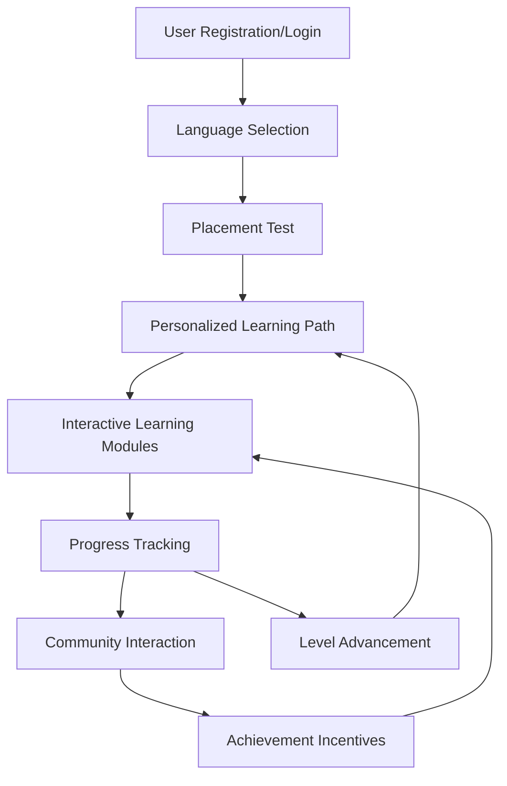

## 1. Product Overview
An immersive online language learning platform supporting multiple languages including English, Japanese, Korean, and other mainstream languages.
- Provides a comprehensive learning experience with leveled courses, interactive modules, and community features
- Targets language learners of all levels seeking structured, engaging, and personalized learning paths

## 2. Core Features

### 2.1 User Roles
| Role | Registration Method | Core Permissions |
|------|---------------------|------------------|
| Learner | Email/Google/Facebook registration | Access all learning features, track progress, interact with community |
| Admin | Invitation only | Manage courses, users, and platform settings |

### 2.2 Feature Module
1. **Home Page**: Hero section, language selection, featured courses, progress overview
2. **Course Dashboard**: Leveled course system, learning path visualization
3. **Learning Modules**: Vocabulary memorization, grammar exercises, oral shadowing, listening training
4. **Progress Tracking**: Detailed statistics, achievement badges, learning history
5. **User Profile**: Personal information, learning preferences, achievement showcase
6. **Community Hub**: Discussion forums, leaderboards, achievement incentives

### 2.3 Page Details
| Page Name | Module Name | Feature description |
|-----------|-------------|---------------------|
| Home Page | Hero Section | Dynamic language showcase, platform value proposition, quick access to learning |
| Home Page | Language Selection | Multi-language support with flags and language names |
| Home Page | Featured Courses | Curated courses based on user interests and proficiency level |
| Home Page | Progress Overview | Quick snapshot of current learning status and upcoming lessons |
| Course Dashboard | Level Navigation | Visual representation of course levels and progression paths |
| Course Dashboard | Course Content | Organized lessons with prerequisites and completion status |
| Learning Modules | Vocabulary Builder | Flashcard system with spaced repetition, pronunciation guides |
| Learning Modules | Grammar Exercises | Interactive drills with instant feedback and explanations |
| Learning Modules | Oral Shadowing | Speech recognition for pronunciation practice and comparison |
| Learning Modules | Listening Training | Audio exercises with comprehension questions and transcript options |
| Progress Tracking | Statistics Dashboard | Detailed metrics on time spent, completion rates, and skill improvement |
| Progress Tracking | Achievement System | Badges and rewards for completing milestones and challenges |
| Progress Tracking | Learning History | Timeline of activities and skill development |
| User Profile | Personal Information | Account settings, language preferences, and learning goals |
| User Profile | Learning Preferences | Customizable settings for learning pace and focus areas |
| User Profile | Achievement Showcase | Display of earned badges and certifications |
| Community Hub | Discussion Forums | Topic-based conversations, language exchange opportunities |
| Community Hub | Leaderboards | Performance-based rankings and friendly competition |
| Community Hub | Achievement Incentives | Points system and rewards for active participation |

## 3. Core Process
### User Journey
1. User registers or logs in to the platform
2. Selects target language(s) and sets learning goals
3. Takes placement test to determine initial proficiency level
4. Receives personalized learning path recommendation
5. Engages with interactive learning modules
6. Tracks progress and receives feedback
7. Participates in community activities and earns achievements
8. Advances through course levels as proficiency improves

## 4. User Interface Design
### 4.1 Design Style
- Primary Colors: #4361ee (indigo) and #3a0ca3 (dark purple)
- Secondary Colors: #4cc9f0 (light blue), #f72585 (pink), #4cc9f0 (light blue)
- Button Style: Rounded corners (8px), subtle shadow effects
- Font: Inter (sans-serif) for clean readability
- Font Sizes: Headings (24-32px), Subheadings (18-22px), Body (14-16px)
- Layout Style: Card-based design with ample white space, responsive grid system
- Icon Style: Clean, minimal line icons with subtle animations

### 4.2 Page Design Overview
| Page Name | Module Name | UI Elements |
|-----------|-------------|-------------|
| Home Page | Hero Section | Full-width gradient background, animated language icons, clear call-to-action buttons |
| Home Page | Language Selection | Grid of language cards with flags, hover effects, and selection indicators |
| Course Dashboard | Level Navigation | Interactive flowchart visualization with progress indicators and level locks |
| Learning Modules | Vocabulary Builder | Flashcard interface with flip animations, progress bars, and pronunciation buttons |
| Learning Modules | Grammar Exercises | Interactive forms with instant feedback, color-coded correction indicators |
| Learning Modules | Oral Shadowing | Waveform visualization, recording interface, comparison tools |
| Progress Tracking | Statistics Dashboard | Data visualizations with charts, progress bars, and achievement badges |
| Community Hub | Discussion Forums | Threaded conversation layout, user avatars, and engagement metrics |
| Community Hub | Leaderboards | Ranked list with user avatars, points, and achievement indicators |

### 4.3 Responsiveness
- Desktop-first design with mobile-adaptive layouts
- Touch optimization for mobile devices
- Responsive breakpoints: 360px (mobile), 768px (tablet), 1200px (desktop)
- Collapsible navigation for smaller screens
- Optimized touch targets for interactive elements

### 4.4 3D Scene Guidance (Not Applicable)
- No 3D elements required for this platform