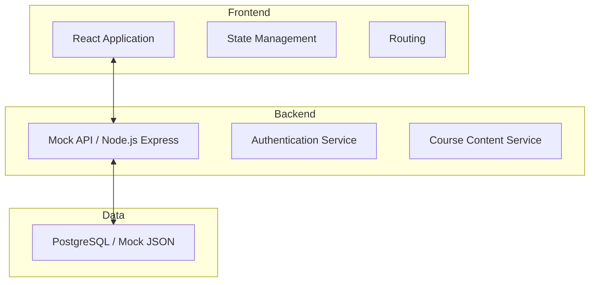
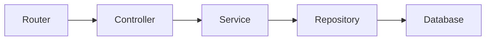
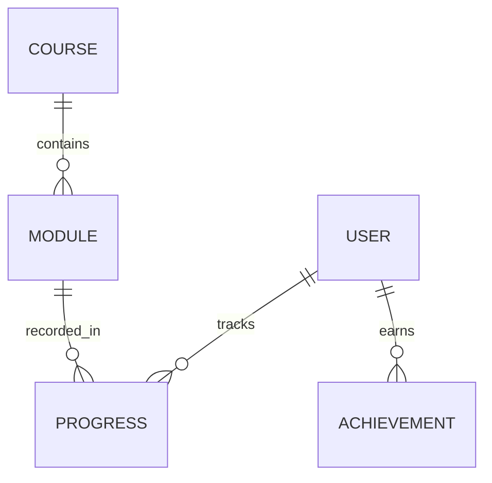

## 1. Architecture Design


## 2. Technology Description
- Frontend: React@18 + tailwindcss@3 + vite
- State Management: Zustand or React Context
- Icons: lucide-react
- Routing: react-router-dom
- Initialization Tool: vite-init

## 3. Route Definitions
| Route | Purpose |
|-------|---------|
| / | Landing page |
| /login | Authentication |
| /dashboard | User progress and personalized path |
| /courses | Leveled course catalog |
| /learn/:moduleId | Interactive learning interface |
| /community | Leaderboards and social features |

## 4. API Definitions (if backend exists)
```typescript
interface User {
  id: string;
  name: string;
  targetLanguages: string[];
  progress: Progress[];
}

interface CourseModule {
  id: string;
  title: string;
  type: 'vocabulary' | 'grammar' | 'shadowing' | 'listening';
  level: string;
  content: any;
}

// GET /api/user/dashboard
// GET /api/courses
// POST /api/progress
```

## 5. Server Architecture Diagram (if backend exists)


## 6. Data Model (if applicable)
### 6.1 Data Model Definition


### 6.2 Data Definition Language
```sql
CREATE TABLE users (
    id UUID PRIMARY KEY,
    name VARCHAR(255),
    email VARCHAR(255) UNIQUE
);

CREATE TABLE modules (
    id UUID PRIMARY KEY,
    course_id UUID,
    type VARCHAR(50),
    level VARCHAR(50)
);
```
