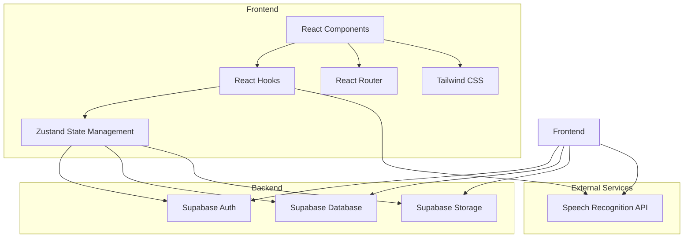
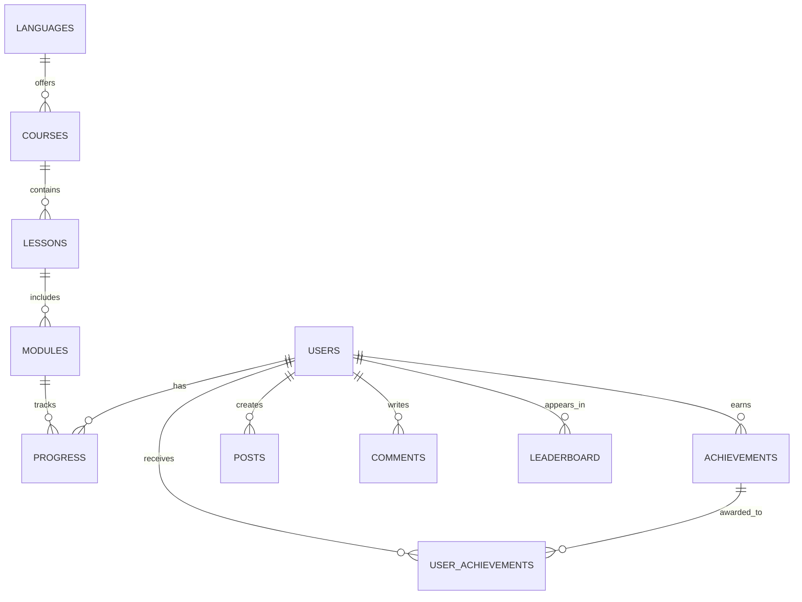

## 1. Architecture Design


## 2. Technology Description
- Frontend: React@18 + TypeScript + Tailwind CSS@3 + Vite
- Backend: Supabase (Authentication, Database, Storage)
- Initialization Tool: Vite-init
- State Management: Zustand
- Routing: React Router DOM
- UI Components: Custom components with Tailwind
- External APIs: Speech recognition for oral shadowing exercises

## 3. Route Definitions
| Route | Purpose |
|-------|---------|
| / | Home page with language selection and featured courses |
| /login | User login page |
| /register | User registration page |
| /dashboard | Course dashboard with level navigation |
| /courses/:courseId | Course details and lessons |
| /modules/:moduleId | Interactive learning modules |
| /progress | Learning progress tracking and statistics |
| /profile | User profile and settings |
| /community | Community hub with forums and leaderboards |
| /achievements | Achievement showcase and rewards |

## 4. API Definitions
### Authentication API
```typescript
// User registration
interface RegisterRequest {
  email: string;
  password: string;
  name: string;
}

interface RegisterResponse {
  user: User;
  session: Session;
}

// User login
interface LoginRequest {
  email: string;
  password: string;
}

interface LoginResponse {
  user: User;
  session: Session;
}
```

### Course API
```typescript
// Course data
interface Course {
  id: string;
  language: string;
  level: string;
  title: string;
  description: string;
  lessons: Lesson[];
}

interface Lesson {
  id: string;
  courseId: string;
  title: string;
  description: string;
  modules: Module[];
  order: number;
}

interface Module {
  id: string;
  lessonId: string;
  type: 'vocabulary' | 'grammar' | 'oral' | 'listening';
  title: string;
  content: any;
  order: number;
}
```

### Progress API
```typescript
// Progress data
interface Progress {
  id: string;
  userId: string;
  courseId: string;
  lessonId: string;
  moduleId: string;
  completed: boolean;
  score: number;
  lastAccessed: string;
}

// Statistics data
interface Statistics {
  userId: string;
  totalTimeSpent: number;
  completedModules: number;
  streak: number;
  achievements: Achievement[];
}

interface Achievement {
  id: string;
  name: string;
  description: string;
  icon: string;
  unlockedAt: string;
}
```

### Community API
```typescript
// Forum post
interface Post {
  id: string;
  userId: string;
  title: string;
  content: string;
  createdAt: string;
  likes: number;
  comments: Comment[];
}

interface Comment {
  id: string;
  postId: string;
  userId: string;
  content: string;
  createdAt: string;
}

// Leaderboard entry
interface LeaderboardEntry {
  userId: string;
  name: string;
  points: number;
  rank: number;
}
```

## 5. Data Model
### 5.1 Data Model Definition


### 5.2 Data Definition Language
```sql
-- Languages table
CREATE TABLE languages (
  id SERIAL PRIMARY KEY,
  code VARCHAR(10) UNIQUE NOT NULL,
  name VARCHAR(50) NOT NULL,
  flag VARCHAR(10) NOT NULL
);

-- Courses table
CREATE TABLE courses (
  id SERIAL PRIMARY KEY,
  language_id INTEGER REFERENCES languages(id),
  level VARCHAR(20) NOT NULL,
  title VARCHAR(100) NOT NULL,
  description TEXT,
  image_url VARCHAR(255)
);

-- Lessons table
CREATE TABLE lessons (
  id SERIAL PRIMARY KEY,
  course_id INTEGER REFERENCES courses(id),
  title VARCHAR(100) NOT NULL,
  description TEXT,
  order_number INTEGER NOT NULL
);

-- Modules table
CREATE TABLE modules (
  id SERIAL PRIMARY KEY,
  lesson_id INTEGER REFERENCES lessons(id),
  type VARCHAR(20) NOT NULL,
  title VARCHAR(100) NOT NULL,
  content JSONB NOT NULL,
  order_number INTEGER NOT NULL
);

-- Progress table
CREATE TABLE progress (
  id SERIAL PRIMARY KEY,
  user_id UUID REFERENCES auth.users(id),
  module_id INTEGER REFERENCES modules(id),
  completed BOOLEAN DEFAULT FALSE,
  score INTEGER,
  last_accessed TIMESTAMP DEFAULT NOW()
);

-- Achievements table
CREATE TABLE achievements (
  id SERIAL PRIMARY KEY,
  name VARCHAR(100) NOT NULL,
  description TEXT,
  icon VARCHAR(255),
  requirement JSONB
);

-- User achievements table
CREATE TABLE user_achievements (
  id SERIAL PRIMARY KEY,
  user_id UUID REFERENCES auth.users(id),
  achievement_id INTEGER REFERENCES achievements(id),
  unlocked_at TIMESTAMP DEFAULT NOW()
);

-- Posts table (for community forums)
CREATE TABLE posts (
  id SERIAL PRIMARY KEY,
  user_id UUID REFERENCES auth.users(id),
  title VARCHAR(200) NOT NULL,
  content TEXT NOT NULL,
  created_at TIMESTAMP DEFAULT NOW(),
  likes INTEGER DEFAULT 0
);

-- Comments table
CREATE TABLE comments (
  id SERIAL PRIMARY KEY,
  post_id INTEGER REFERENCES posts(id),
  user_id UUID REFERENCES auth.users(id),
  content TEXT NOT NULL,
  created_at TIMESTAMP DEFAULT NOW()
);

-- Leaderboard table
CREATE TABLE leaderboard (
  id SERIAL PRIMARY KEY,
  user_id UUID REFERENCES auth.users(id),
  points INTEGER DEFAULT 0,
  last_updated TIMESTAMP DEFAULT NOW()
);

-- User profiles table (extends auth.users)
CREATE TABLE profiles (
  id UUID PRIMARY KEY REFERENCES auth.users(id),
  name VARCHAR(100) NOT NULL,
  avatar_url VARCHAR(255),
  language_preferences JSONB,
  learning_goals TEXT,
  created_at TIMESTAMP DEFAULT NOW()
);

-- Grant permissions
GRANT SELECT ON languages, courses, lessons, modules TO anon;
GRANT ALL PRIVILEGES ON progress, user_achievements, posts, comments, leaderboard, profiles TO authenticated;
```