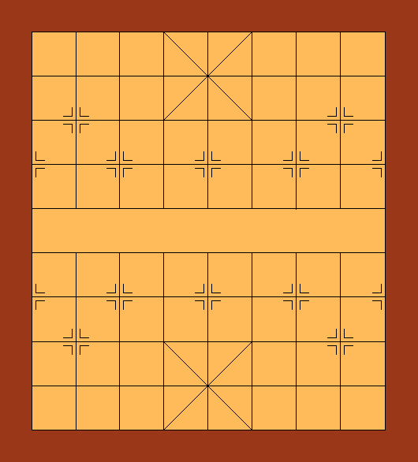

# harmless

Chinese Chess (Xiangqi) engine written in C with a simple Python/Pygame UI.



## Features
- UCCI protocol engine (`src/harmless`) with opening book support (`openbook.c`, `pycchess/BOOK.DAT`)
- Python UI (`pycchess/cchess.py`) with sounds and simple mouse controls
- Keyboard shortcut: `space` to start a new game

## Requirements
- Build: `gcc` or `clang`, `make`
- UI runtime: `python 2.7`, `pygame 1.9.x`
  - Python 2.7 is required for the current UI. Python 3 is not supported without code changes.

## Install & Run (Linux/macOS)
- Build engine and install into UI folder:
  - `make && make install`
- Run the UI:
  - `python2 pycchess/cchess.py`

Tip: If `python2` is not available, create a Python 2.7 environment (e.g., with Conda) and install Pygame:
- `conda create -n py27 python=2.7`
- `conda activate py27`
- `pip install pygame==1.9.6`
- `make && make install && python pycchess/cchess.py`

## Windows
- Recommended: use a Python 2.7 environment and install `pygame 1.9.x`
  - `conda create -n py27 python=2.7`
  - `conda activate py27`
  - `pip install pygame==1.9.2`
- Build the engine via MSYS2 or WSL:
  - MSYS2: install `gcc` and `make`, then run `make && make install`
  - WSL: build on Ubuntu and run the UI with Windows Python 2.7
- Start the UI:
  - `python pycchess/cchess.py`

## Usage
- Human vs AI:
  - `python2 pycchess/cchess.py`
- Network mode (two machines):
  - Red side: `python2 pycchess/cchess.py -nr <host>`
  - Black side: `python2 pycchess/cchess.py -nb <host>`
- Controls:
  - Mouse: click to select and move pieces
  - Keyboard: `space` starts a new game

## Engine Only (UCCI)
- You can interact with the engine directly via UCCI over stdin/stdout:
  - ```
    ./src/harmless
    ucci
    isready
    quit
    ```

## Development
- Top-level `Makefile` builds `src/harmless` and copies it to `pycchess/` on `make install`.
- Useful commands:
  - Build: `make`
  - Install into UI: `make install`
  - Clean: `make clean`

## Troubleshooting
- Pygame install issues:
  - Ensure SDL dependencies are present (Linux package: `libsdl`, `libsdl-image`, `libsdl-mixer`)
  - Use a Python 2.7 environment to match the UI code
- UI window not opening:
  - Verify `pygame` loads: `python2 -c "import pygame; print(pygame.ver)"`
  - Check that `pycchess/harmless` exists after `make install`

## License
- The Python UI includes GPLv3 headers. See source files for details.
