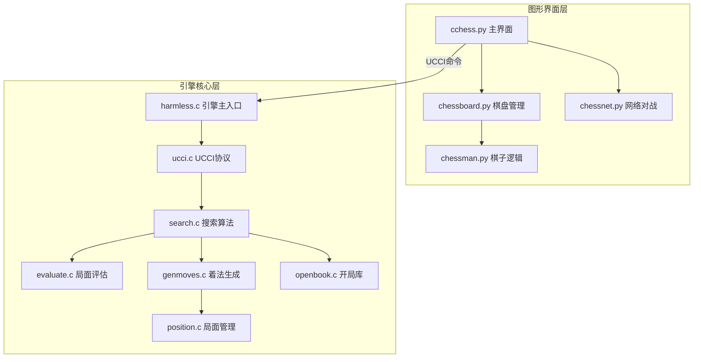

# harmless 中国象棋引擎项目分析报告

## 1. 仓库概览

harmless 是一个中国象棋引擎项目，包含 C 语言编写的引擎核心和 Python 编写的图形界面。该项目提供了完整的中国象棋游戏功能，支持人机对战和网络对战。

- **C 语言引擎核心**：实现了完整的中国象棋引擎，包括着法生成、局面评估、搜索算法等功能
- **Python 图形界面**：使用 pygame 库实现了友好的图形界面，支持鼠标操作和音效
- **UCCI 协议**：引擎实现了 UCCI（Universal Chinese Chess Interface）协议，用于与界面通信
- **开局库**：包含 BOOK.DAT 开局库，提高引擎的开局表现

## 2. 目录结构

项目采用清晰的分层结构，将引擎核心和图形界面分离，便于维护和扩展。引擎核心使用 C 语言编写，位于 `src/` 目录；图形界面使用 Python 编写，位于 `pycchess/` 目录。

```text
├── pycchess/         # Python 图形界面
│   ├── image/        # 棋子和棋盘图片
│   ├── sounds/       # 游戏音效
│   ├── BOOK.DAT      # 开局库
│   ├── cchess.py     # 主界面文件
│   ├── chessboard.py # 棋盘和游戏逻辑
│   ├── chessman.py   # 棋子类
│   ├── chessnet.py   # 网络对战功能
│   └── common.py     # 通用常量和函数
├── src/              # C 语言引擎核心
│   ├── Makefile      # 编译配置
│   ├── base.h        # 基础定义
│   ├── evaluate.c    # 局面评估
│   ├── evaluate.h
│   ├── genmoves.c    # 着法生成
│   ├── genmoves.h
│   ├── harmless.c    # 引擎主文件
│   ├── hash.c        # 哈希表
│   ├── hash.h
│   ├── movesort.c    # 着法排序
│   ├── movesort.h
│   ├── openbook.c    # 开局库
│   ├── openbook.h
│   ├── pipe.c        # 管道通信
│   ├── pipe.h
│   ├── position.c    # 棋盘位置管理
│   ├── position.h
│   ├── search.c      # 搜索算法
│   ├── search.h
│   ├── ucci.c        # UCCI 协议实现
│   └── ucci.h
├── .gitignore
├── Makefile          # 项目编译和安装配置
└── README.md         # 项目说明
```

* **pycchess/**：包含 Python 编写的图形界面，负责用户交互和显示
* **src/**：包含 C 语言编写的引擎核心，负责棋局分析和走法计算
* **Makefile**：定义了编译和安装规则，将编译后的引擎可执行文件复制到 pycchess 目录

## 3. 系统架构与主流程

harmless 项目采用典型的引擎-界面分离架构，通过 UCCI 协议进行通信。整体架构设计清晰，模块职责明确，便于维护和扩展。

### 核心架构组件

1. **引擎核心**（C 语言）
   - 局面表示与管理（position.c）
   - 着法生成（genmoves.c）
   - 局面评估（evaluate.c）
   - 搜索算法（search.c）
   - UCCI 协议实现（ucci.c）

2. **图形界面**（Python）
   - 主界面控制（cchess.py）
   - 棋盘管理（chessboard.py）
   - 棋子逻辑（chessman.py）
   - 网络对战（chessnet.py）

### 主流程

1. **启动流程**
   - 用户运行 `python cchess.py` 启动游戏
   - 界面启动 C 语言引擎进程，建立管道通信
   - 界面发送 UCCI 命令初始化引擎
   - 引擎加载开局库，准备就绪

2. **游戏流程**
   - 用户通过鼠标选择并移动棋子
   - 界面验证走法合法性，更新棋盘状态
   - 界面将当前局面通过 UCCI 协议发送给引擎
   - 引擎分析局面，计算最佳走法
   - 引擎通过 UCCI 协议返回最佳走法
   - 界面执行引擎的走法，更新棋盘状态
   - 重复上述过程，直到游戏结束

3. **网络对战流程**
   - 用户通过 `-n` 参数启动网络对战模式
   - 界面建立网络连接，等待对手连接
   - 双方通过网络交换走法信息
   - 界面根据接收到的走法更新棋盘状态

### 架构图



## 4. 核心功能模块

### 4.1 引擎核心模块

#### 局面管理（position.c）

负责棋盘位置的表示和管理，包括：
- 棋盘状态的初始化和更新
- 棋子位置的存储和访问
- FEN 格式的解析和生成

#### 着法生成（genmoves.c）

负责生成所有合法的着法，包括：
- 各类棋子的走法规则实现
- 着法合法性检查
- 着法列表的生成

#### 局面评估（evaluate.c）

负责评估局面的优劣，包括：
- 棋子价值评估
- 位置价值评估
- 局面优势计算

#### 搜索算法（search.c）

负责搜索最佳走法，包括：
-  minimax 搜索算法
- α-β 剪枝优化
- 搜索深度控制

#### UCCI 协议（ucci.c）

负责与图形界面的通信，包括：
- UCCI 命令的解析和处理
- 引擎信息的输出
- 最佳走法的返回

### 4.2 图形界面模块

#### 主界面控制（cchess.py）

负责游戏的整体控制，包括：
- 引擎进程的启动和管理
- 事件处理（鼠标点击、键盘输入）
- 游戏状态的管理
- 与引擎的通信

#### 棋盘管理（chessboard.py）

负责棋盘的显示和逻辑，包括：
- 棋盘的绘制
- 棋子的移动和规则检查
- 游戏结束的判断
- 音效的播放

#### 棋子逻辑（chessman.py）

负责棋子的表示和移动规则，包括：
- 各类棋子的移动规则
- 棋子的绘制
- 棋子状态的管理

#### 网络对战（chessnet.py）

负责网络对战功能，包括：
- 网络连接的建立和管理
- 走法信息的发送和接收
- 网络错误的处理

## 5. 核心 API/类/函数

### 5.1 引擎核心 API

#### `main()` 函数（harmless.c）

**功能**：引擎的主入口，处理 UCCI 命令并调用相应的函数。

**参数**：命令行参数
**返回值**：退出状态码

**关键流程**：
- 初始化哈希表和开局库
- 处理 UCCI 命令循环
- 根据命令类型调用相应的处理函数
- 清理资源并退出

#### `think()` 函数（search.c）

**功能**：搜索最佳走法并输出结果。

**参数**：搜索深度
**返回值**：无

**关键流程**：
- 初始化搜索参数
- 执行搜索算法
- 输出最佳走法

#### `fen_to_arr()` 函数（position.c）

**功能**：将 FEN 格式的局面转换为内部表示。

**参数**：FEN 字符串
**返回值**：无

**关键流程**：
- 解析 FEN 字符串
- 更新棋盘状态
- 设置当前走子方

### 5.2 图形界面 API

#### `chessboard` 类（chessboard.py）

**功能**：管理棋盘状态和游戏逻辑。

**关键方法**：
- `fen_parse()`：解析 FEN 格式的局面
- `move_chessman()`：移动棋子并检查合法性
- `make_move()`：执行移动操作
- `unmake_move()`：撤销移动操作
- `gen_moves()`：生成所有合法着法
- `game_over()`：判断游戏是否结束

#### `runGame()` 函数（cchess.py）

**功能**：游戏主循环，处理事件和更新界面。

**参数**：无
**返回值**：无

**关键流程**：
- 处理鼠标和键盘事件
- 绘制棋盘和棋子
- 处理引擎的走法
- 检查游戏是否结束

#### `enqueue_output()` 函数（cchess.py）

**功能**：将引擎输出加入队列，用于异步处理。

**参数**：输出流和队列
**返回值**：无

**关键流程**：
- 从引擎输出流读取数据
- 将数据加入队列
- 关闭输出流

## 6. 技术栈与依赖

| 技术/依赖 | 用途 | 版本要求 | 来源 |
|----------|------|---------|------|
| C 语言 | 引擎核心开发 | - | <src/> |
| Python | 图形界面开发 | 2.7.x | <pycchess/> |
| pygame | 图形界面和音效 | 1.9.x | <pycchess/cchess.py> |
| gcc | 编译 C 语言代码 | - | <src/Makefile> |
| UCCI 协议 | 引擎与界面通信 | - | <src/ucci.c> |

## 7. 关键模块与典型用例

### 7.1 人机对战

**功能说明**：玩家与电脑进行对战，电脑使用引擎计算最佳走法。

**配置与依赖**：
- 编译好的 harmless 引擎
- Python 2.7 和 pygame 1.9.x

**使用步骤**：
1. 编译安装：`make && make install`
2. 进入 pycchess 目录：`cd pycchess`
3. 启动游戏：`python cchess.py`
4. 使用鼠标点击选择并移动棋子
5. 电脑会自动计算并执行最佳走法

**示例代码**：
```python
# 启动引擎进程
p = Popen("./harmless", stdin=PIPE, stdout=PIPE, close_fds=ON_POSIX)
(chessboard.fin, chessboard.fout) = (p.stdin, p.stdout)

# 初始化引擎
chessboard.fin.write("ucci\n")
chessboard.fin.flush()

# 发送局面信息并请求走法
fen_str = chessboard.get_fen()
chessboard.fin.write('position fen ' + fen_str + '\n')
chessboard.fin.write('go depth ' + str(AI_SEARCH_DEPTH)  + '\n')
chessboard.fin.flush()
```

### 7.2 网络对战

**功能说明**：两个玩家通过网络进行对战。

**配置与依赖**：
- Python 2.7 和 pygame 1.9.x
- 网络连接

**使用步骤**：
1. 红方启动：`python cchess.py -nr`
2. 黑方启动：`python cchess.py -nb`
3. 输入对方 IP 地址
4. 使用鼠标点击选择并移动棋子
5. 走法会通过网络发送给对方

**示例代码**：
```python
# 启动网络对战模式
if len(sys.argv) == 2 and sys.argv[1][:2] == '-n':
    chessboard.net = chessnet()

    if sys.argv[1][2:] == 'r':
        pygame.display.set_caption("red")
        chessboard.side = RED
    elif sys.argv[1][2:] == 'b':
        pygame.display.set_caption("black")
        chessboard.side = BLACK
```

## 8. 配置、部署与开发

### 8.1 编译与安装

**编译步骤**：
1. 进入项目根目录
2. 执行 `make` 命令编译引擎核心
3. 执行 `make install` 命令将编译后的可执行文件复制到 pycchess 目录

**编译配置**：
- 使用 gcc 编译器
- 优化级别：O3
- 警告选项：Wall

### 8.2 运行环境

**硬件要求**：
- 基本的 CPU 和内存资源
- 支持图形显示的环境

**软件要求**：
- Linux 或 macOS
- Python 2.7.x
- pygame 1.9.x

**Windows 用户**：
- 可以从 GitHub 下载预编译的 Windows 版本
- 直接运行 cchess.exe

### 8.3 开发流程

1. 修改 C 语言引擎代码
2. 执行 `make` 重新编译
3. 运行 `python cchess.py` 测试修改效果
4. 根据测试结果调整代码

## 9. 监控与维护

### 9.1 日志系统

引擎支持调试日志功能，通过 `DEBUG_LOG` 宏启用：

```c
#ifdef DEBUG_LOG
    logfile = fopen("harmless.log", "w");
#endif
```

### 9.2 常见问题与解决方案

| 问题 | 原因 | 解决方案 |
|------|------|----------|
| 引擎无法启动 | 编译失败或权限问题 | 检查编译过程，确保有执行权限 |
| 图形界面无响应 | pygame 安装问题 | 确保 pygame 1.9.x 正确安装 |
| 网络对战连接失败 | 网络设置问题 | 检查网络连接和防火墙设置 |
| 引擎走法错误 | 规则实现问题 | 检查着法生成和规则判断代码 |

## 10. 总结与亮点回顾

harmless 是一个设计合理、功能完整的中国象棋引擎项目，具有以下亮点：

1. **清晰的架构设计**：引擎核心与图形界面分离，通过 UCCI 协议通信，便于维护和扩展。

2. **完整的功能实现**：
   - 支持人机对战和网络对战
   - 实现了完整的中国象棋规则
   - 包含开局库，提高引擎表现
   - 支持音效和图形化界面

3. **高效的引擎实现**：
   - 使用 C 语言编写引擎核心，性能优异
   - 实现了搜索算法、局面评估等核心功能
   - 支持哈希表和开局库，提高搜索效率

4. **友好的用户界面**：
   - 使用 pygame 实现了图形化界面
   - 支持鼠标操作，交互直观
   - 包含音效，提升游戏体验

5. **跨平台支持**：
   - 支持 Linux 和 macOS
   - 提供 Windows 预编译版本

harmless 项目展示了如何将 C 语言的高性能与 Python 的易用性相结合，构建一个完整的中国象棋游戏系统。它不仅是一个功能完整的游戏，也是学习中国象棋引擎实现和 UCCI 协议的优秀资源。

通过模块化的设计和清晰的代码结构，harmless 项目为中国象棋引擎的开发提供了一个良好的参考框架，同时也为爱好者提供了一个可以直接使用的中国象棋游戏。